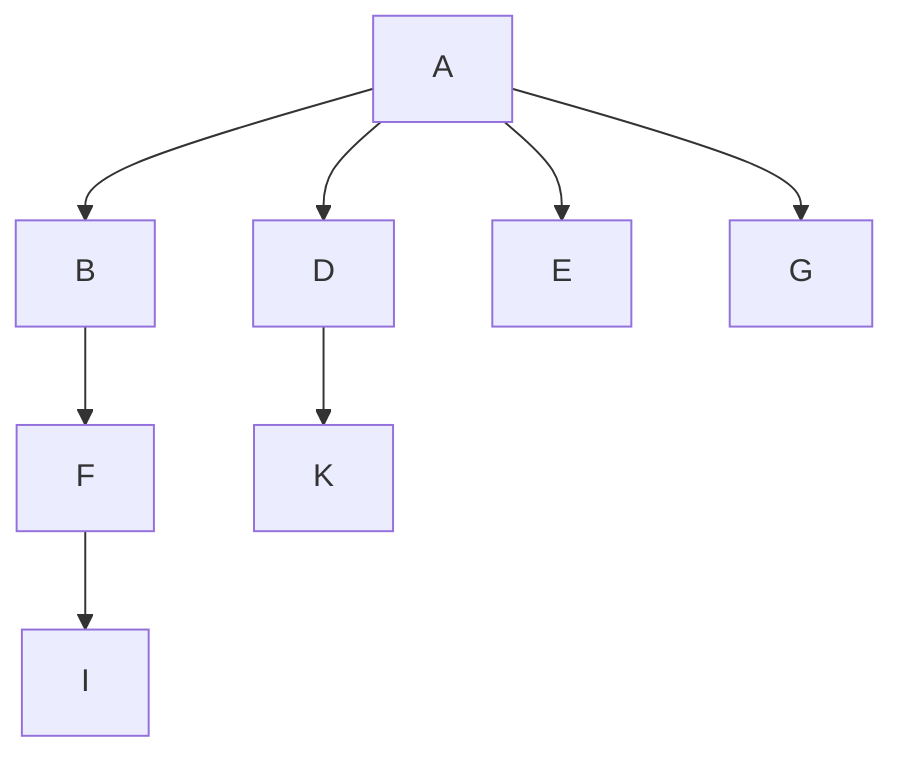
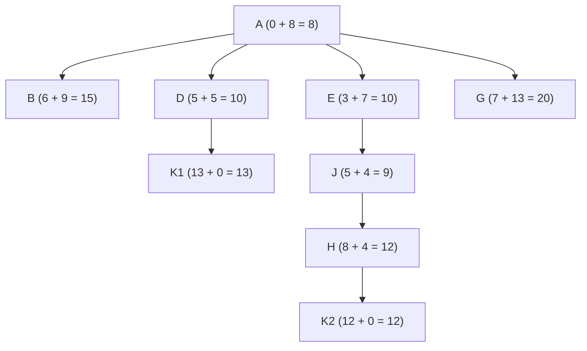
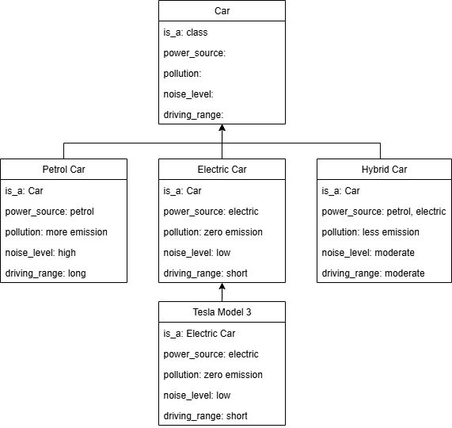
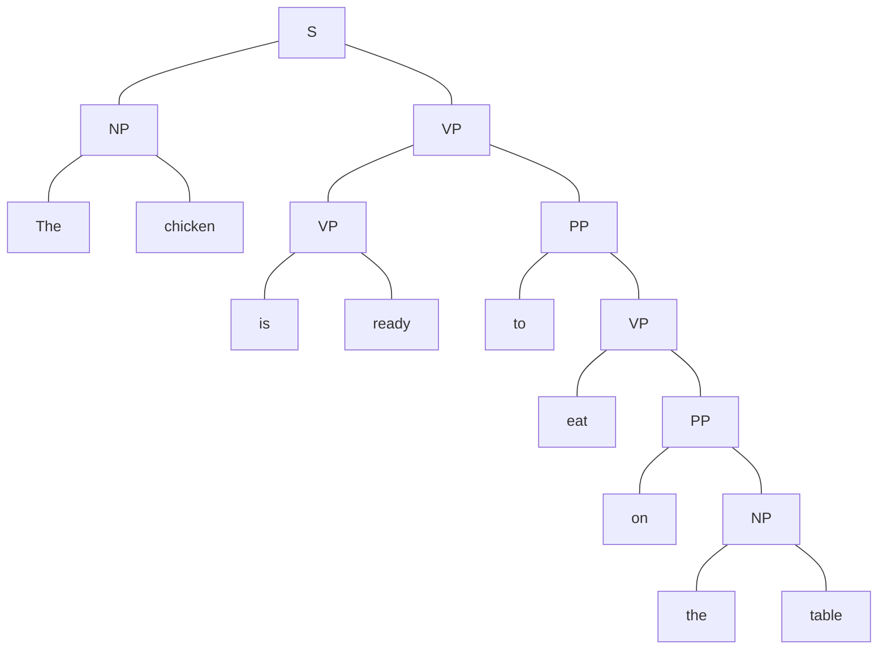
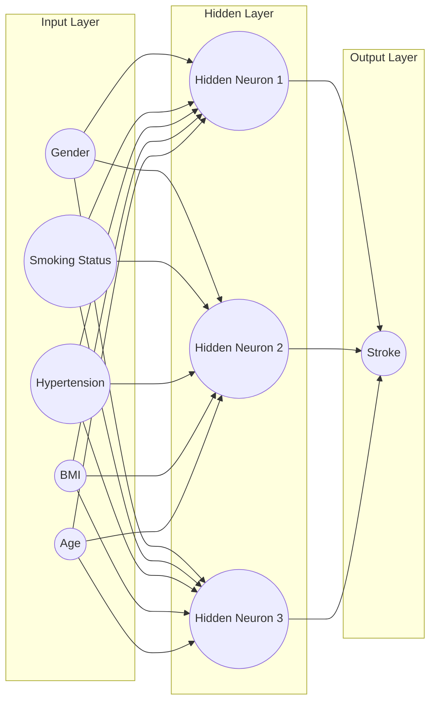

# BACS3074 OCT 2024 Answers

[Link to the paper](https://eprints.tarc.edu.my/30307/1/BACS3074.pdf)

- [Question 1](#question-1)
- [Question 2](#question-2)
- [Question 3](#question-3)
- [Question 4](#question-4)

> [!IMPORTANT]
> View the diagrams in website that supports mermaid syntax, instead of mobile app.

## Answers

### Question 1

a)

i)

| **Goal Formulation** |                                                       |
| -------------------- | ----------------------------------------------------- |
| **Goal**             | Station K                                             |
| **Optimal Solution** | Arrive at Station K in the shortest distance possible |
| **Abstraction**      | The time taken to reach Station K                     |

| **Problem Formulation** |                                                            |
| ----------------------- | ---------------------------------------------------------- |
| **Initial State**       | Station A                                                  |
| **Successor Function**  | All steps allowing movement to connected adjacent stations |
| **Step Cost**           | Distance between stations (in KM)                          |
| **Goal Test**           | Check if the current station is Station K                  |

ii)

DFS



> DFS here uses early goal test, so it stops when the goal node K is generated instead of expanded.

A\*



iii)

|               | DFS               | A\*                    |
| ------------- | ----------------- | ---------------------- |
| Search Path   | A → B → F → I → D | A → D → E → J → H → K2 |
| Solution Path | A → D → K         | A → E → J → H → K2     |

iv)

|              | DFS | A\* |
| ------------ | --- | --- |
| Completeness | Yes | Yes |
| Optimality   | No  | Yes |

### Question 2

a)

i) Frames are more suitable as they can represent hierarchical relationships and attributes of objects for structured knowledge, while semantic networks are less suitable as they are better for representing relationships between concepts rather than detailed object attributes.

ii)



b)

| Ambiguity           | Explanation                                                                                                                                                     |
| ------------------- | --------------------------------------------------------------------------------------------------------------------------------------------------------------- |
| Semantic Ambiguity  | The chicken can be interpreted as either an alive animal or as food.                                                                                            |
| Syntactic Ambiguity | The sentence can be interpreted as: The chicken is alive and is ready to eat on the table, or the chicken as a food is prepared on the table ready to be eaten. |

c)



### Question 3

a)

- K = 5
- avg_glucose_level = 200.7
- bmi = 30.5

| avg_glucose_level | bmi  | stroke | distance          |
| ----------------- | ---- | ------ | ----------------- |
| 228.69            | 36.6 | 1      | **_28.64699112_** |
| 100.98            | 28.2 | 1      | 99.74652074       |
| 186.21            | 29.0 | 1      | **_14.56743286_** |
| 213.37            | 36.0 | 0      | **_13.81227353_** |
| 223.36            | 41.5 | 0      | **_25.1887991_**  |
| 122.41            | 40.3 | 0      | 78.90097655       |
| 174.12            | 24.0 | 1      | **_27.3632308_**  |
| 103.26            | 25.4 | 0      | 97.57337547       |
| 75.39             | 37.8 | 0      | 125.5224526       |
| 70.09             | 27.4 | 1      | 130.6467837       |

Stroke = 1 (3 out of 5 neighbors, majority)

b)



c)

```
Accuracy  = (74 + 54) / (74 + 8 + 9 + 54)
          = 0.8828
Precision = 74 / (74 + 9)
          = 0.8916
Recall    = 74 / (74 + 8)
          = 0.9024
```

### Question 4

a) Median filtering works by **replacing the center pixel value** with the **median** of all **intensity values** in the **filter window**.

|       | 0   | 1   | 2   | 3   | 4   | 5   |
| ----- | --- | --- | --- | --- | --- | --- |
| **0** | 0   | 0   | 0   | 0   | 0   | 0   |
| **1** | 0   | 163 | 145 | 144 | 138 | 0   |
| **2** | 0   | 198 | 198 | 144 | 135 | 0   |
| **3** | 0   | 198 | 198 | 144 | 124 | 0   |
| **4** | 0   | 171 | 173 | 170 | 135 | 0   |
| **5** | 0   | 157 | 168 | 168 | 144 | 0   |
| **6** | 0   | 0   | 0   | 0   | 0   | 0   |

b)

```
R1: MIN(0.85, 0.85) * 0.9 = 0.765 Hypertension
R2: MAX(MIN(-0.8, 1.0), 1.0) * 0.85 = 0.85 Hypertension
R3: MAX(MIN(1.0, 0.8), 0.75) * 0.75 = 0.6 Hypertension

0.765 + 0.85 - (0.765 * 0.85) = 0.96475 Hypertension
0.96475 + 0.6 - (0.96475 * 0.6) = 0.9859 Hypertension
```

The patient definitely has hypertension with a certainty factor of 0.9859.
