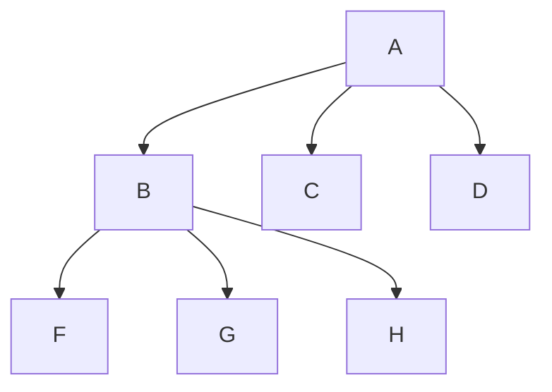
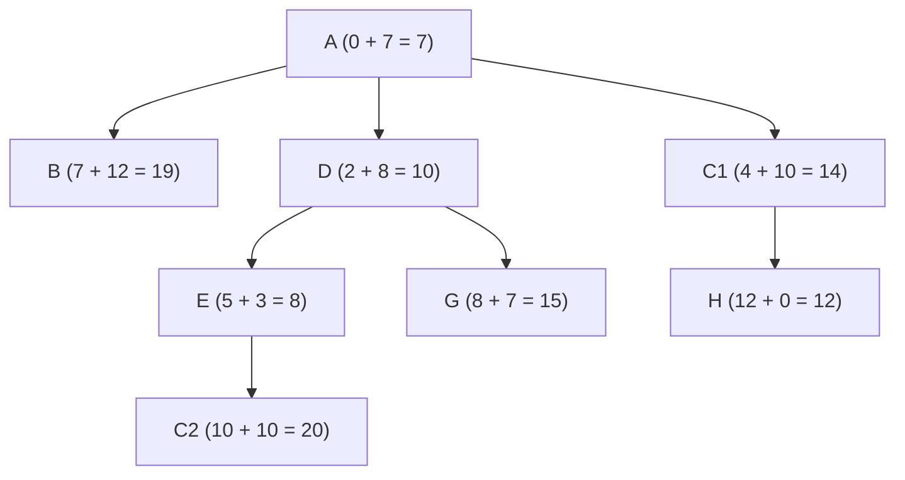
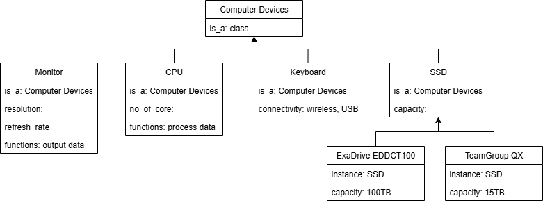
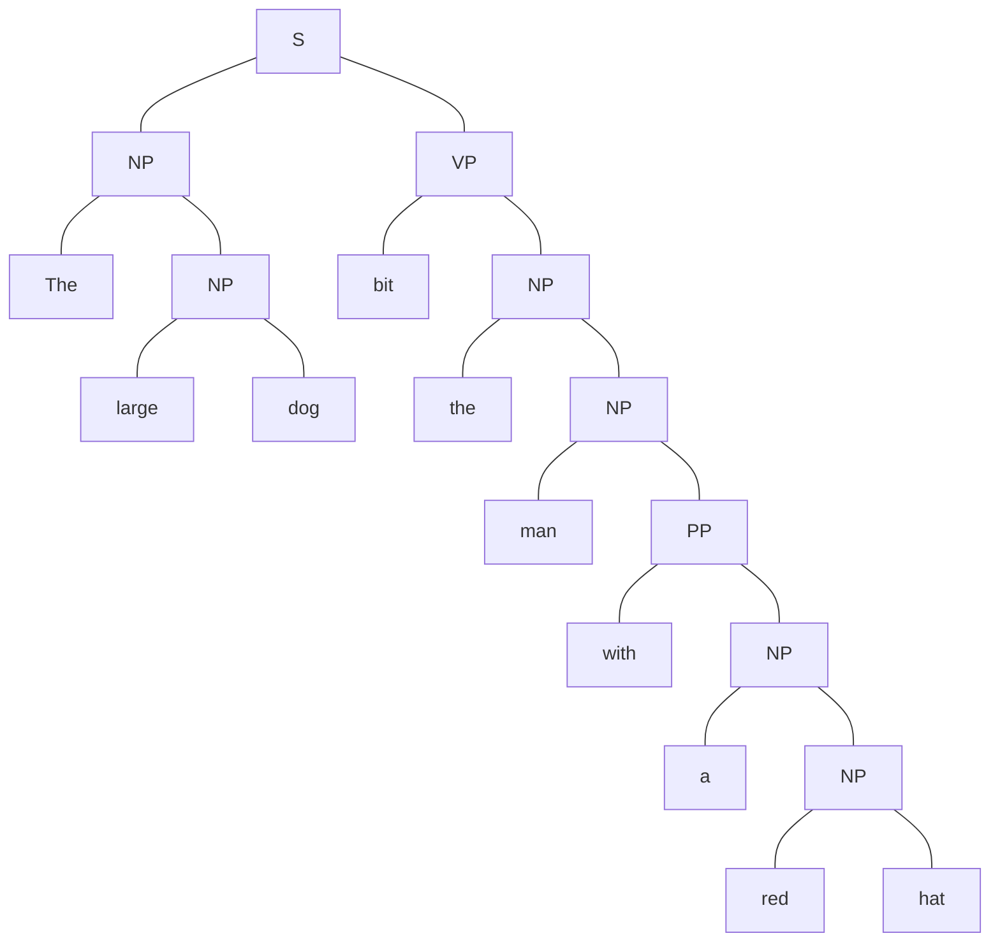
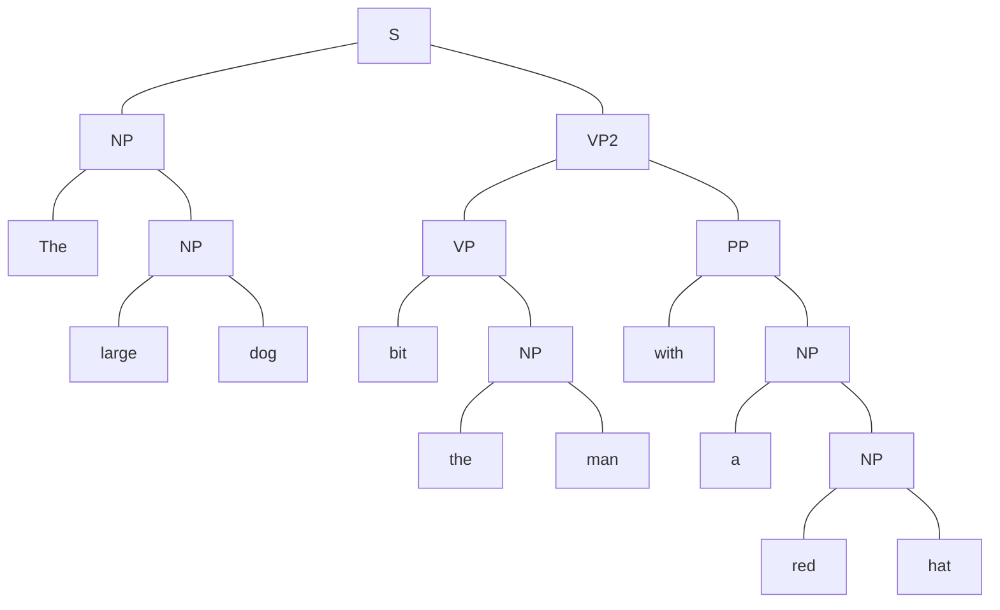

# BACS3074 OCT 2024 Answers

[Link to the paper](https://eprints.tarc.edu.my/30307/1/BACS3074.pdf)

- [Question 1](#question-1)
- [Question 2](#question-2)
- [Question 3](#question-3)
- [Question 4](#question-4)

> [!IMPORTANT]
> View the diagrams in website that supports mermaid syntax, instead of mobile app.

## Answers

### Question 1

a)

- A **human invigilator** interacts with both a **human respondent** and a **machine respondent** through a text interface.
- Human and machine respondents **answer questions** posed by the invigilator.
- If the invigilator cannot reliably **distinguish** between the human and machine responses, the machine is said to have passed the Turing Test.

b)

i)

| **Goal Formulation** |                                                       |
| -------------------- | ----------------------------------------------------- |
| **Goal**             | Station H                                             |
| **Optimal Solution** | Arrive at Station H in the shortest distance possible |
| **Abstraction**      | The time taken to reach Station H                     |

| **Problem Formulation** |                                                            |
| ----------------------- | ---------------------------------------------------------- |
| **Initial State**       | Station A                                                  |
| **Successor Function**  | All steps allowing movement to connected adjacent stations |
| **Step Cost**           | Distance between stations (in KM)                          |
| **Goal Test**           | Check if the current station is Station H                  |

ii)

BFS



> BFS here uses early goal test, so it stops when the goal node H is generated instead of expanded.

A\*



iii)

|             | BFS       | A\*                |
| ----------- | --------- | ------------------ |
| Search Path | A → B     | A → D → E → C1 → H |
| Return Path | A → B → H | A → C1 → H         |

### Question 2

a)

i) The assertion is **True**. Frames is more suitable than semantic network to represent the knowledge in Figure 2 because of it's ability in representing structured knowledge about objects and their attributes with better organization and clarity.

ii)



b)

"The large dog bit the man with a red hat."

- Syntactic ambiguity is exists in sentence S, which is a type of ambiguity that arises from the structure or syntax of a sentence, leading to multiple possible interpretations.
- In this case, the phrase "with a red hat" can be interpreted in two ways:
  1. The large dog using the red hat to bite the man.
  2. The man is wearing a red hat.

b)

> [!NOTE]
> I suppose that the grammar rules missed out the preposition "a", so my answer includes "a" in the parse tree.





### Question 3

a)

i)

C1 = (14., 35.)
C2 = (30., 40.)

| Data Point | Feature 1 | Feature 2 | Distance with C1 | Distance with C2 | Assigned Cluster |
| ---------- | --------- | --------- | ---------------- | ---------------- | ---------------- |
| 1          | 12.8      | 43.6      | 8.7              | 17.6             | C1               |
| 2          | 24.3      | 37.1      | 10.5             | 30.0             | C1               |
| 3          | 18.7      | 35.5      | 4.7              | 12.2             | C1               |
| 4          | 33.9      | 47.9      | 23.7             | 8.8              | C2               |
| 5          | 31.6      | 48.8      | 22.4             | 8.9              | C2               |
| 6          | 24.5      | 26.7      | 13.4             | 14.4             | C1               |
| 7          | 16.9      | 20.8      | 14.5             | 23.2             | C1               |
| 8          | 10.5      | 19.6      | 15.8             | 28.2             | C1               |

ii)

```
New C1
= ((12.8 + 24.3 + 18.7 + 24.5 + 16.9 + 10.5) / 6,
   (43.6 + 37.1 + 35.5 + 26.7 + 20.8 + 19.6) / 6)
= (17.95, 30.55)

New C2
= ((33.9 + 31.6) / 2,
   (47.9 + 48.8) / 2)
= (32.75, 48.35)
```

b)

KNN

|                     | Predicted Positive | Predicted Negative |
| ------------------- | ------------------ | ------------------ |
| **Actual Positive** | 72                 | 12                 |
| **Actual Negative** | 16                 | 1100               |

SVM

|                     | Predicted Positive | Predicted Negative |
| ------------------- | ------------------ | ------------------ |
| **Actual Positive** | 69                 | 15                 |
| **Actual Negative** | 19                 | 1097               |

c)

|           | KNN                                          | SVM                                          |
| --------- | -------------------------------------------- | -------------------------------------------- |
| Accuracy  | (72 + 1100) / (72 + 12 + 16 + 1100) = 0.9767 | (69 + 1097) / (69 + 15 + 19 + 1097) = 0.9717 |
| Precision | 72 / (72 + 16) = 0.8182                      | 69 / (69 + 19) = 0.7841                      |

- KNN performs better as it has higher accuracy and precision.

### Question 4

a)

Erosion

|       | 0   | 1   | 2   | 3   | 4   | 5   | 6   | 7   | 8   |
| ----- | --- | --- | --- | --- | --- | --- | --- | --- | --- |
| **0** | 0   | 0   | 0   | 0   | 0   | 0   | 0   | 0   | 0   |
| **1** | 0   | 0   | 0   | 0   | 0   | 0   | 0   | 0   | 0   |
| **2** | 0   | 0   | 0   | 0   | 0   | 0   | 0   | 0   | 0   |
| **3** | 0   | 0   | 0   | 1   | 1   | 1   | 0   | 0   | 0   |
| **4** | 0   | 0   | 1   | 1   | 1   | 1   | 0   | 0   | 0   |
| **5** | 0   | 0   | 1   | 1   | 1   | 1   | 0   | 0   | 0   |
| **6** | 0   | 0   | 0   | 0   | 0   | 0   | 0   | 0   | 0   |
| **7** | 0   | 0   | 0   | 0   | 0   | 0   | 0   | 0   | 0   |
| **8** | 0   | 0   | 0   | 0   | 0   | 0   | 0   | 0   | 0   |

Dilation

|       | 0   | 1   | 2   | 3   | 4   | 5   | 6   | 7   | 8   |
| ----- | --- | --- | --- | --- | --- | --- | --- | --- | --- |
| **0** | 0   | 0   | 0   | 0   | 0   | 0   | 0   | 0   | 0   |
| **1** | 0   | 1   | 0   | 1   | 1   | 1   | 1   | 0   | 0   |
| **2** | 1   | 1   | 1   | 1   | 1   | 1   | 1   | 1   | 0   |
| **3** | 1   | 1   | 1   | 1   | 1   | 1   | 1   | 1   | 0   |
| **4** | 1   | 1   | 1   | 1   | 1   | 1   | 1   | 1   | 0   |
| **5** | 1   | 1   | 1   | 1   | 1   | 1   | 1   | 1   | 0   |
| **6** | 1   | 1   | 1   | 1   | 1   | 1   | 1   | 0   | 0   |
| **7** | 0   | 1   | 1   | 1   | 1   | 1   | 0   | 0   | 0   |
| **8** | 0   | 0   | 0   | 0   | 0   | 0   | 0   | 0   | 0   |

b)

```
R1: MAX(MIN(0.65, -1.0), 0.6) * 0.7 = 0.42 Influenza
R2: MAX(0.0, 0.85) * 0.8 =  0.68 Influenza
R3: MAX(MIN(0.65, -1.0), 0.7) * 0.9 =  0.63 Influenza

0.42 + 0.68 - (0.42 * 0.68) = 0.8144 Influenza
0.8144 + 0.63 - (0.8144 * 0.63) = 0.9313 Influenza
```

The patient definitely has Influenza.

c) Air conditioner. If the temperature is high, increase the fan speed. If the temperature is low, decrease the fan speed.
