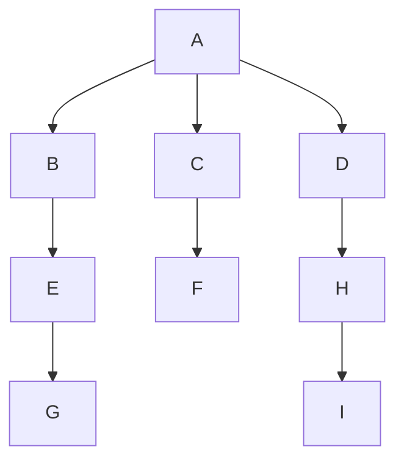
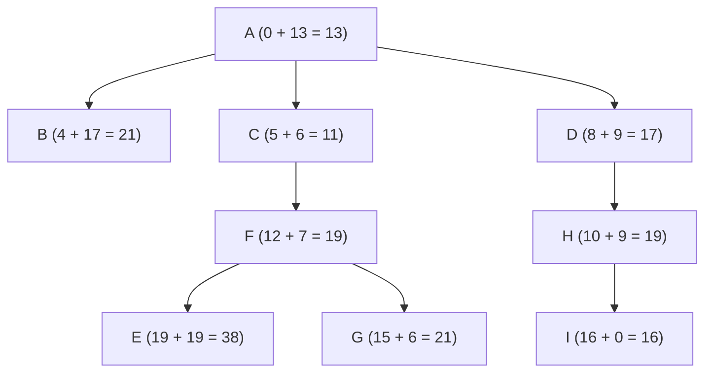
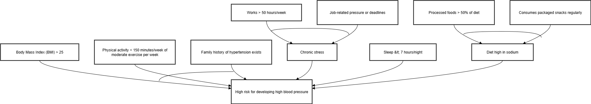
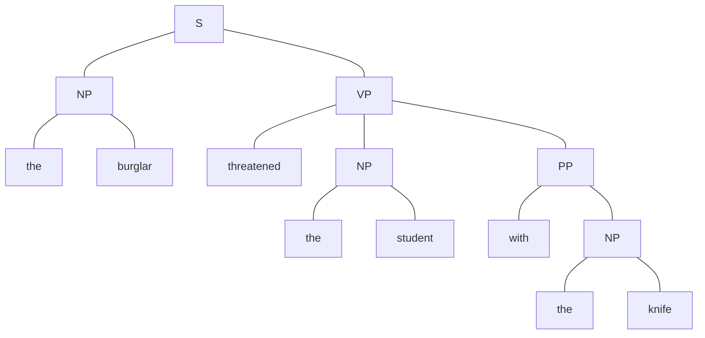
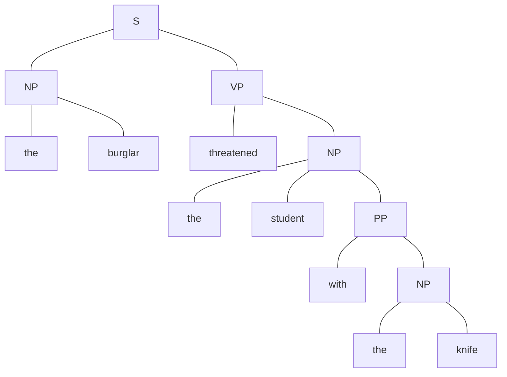
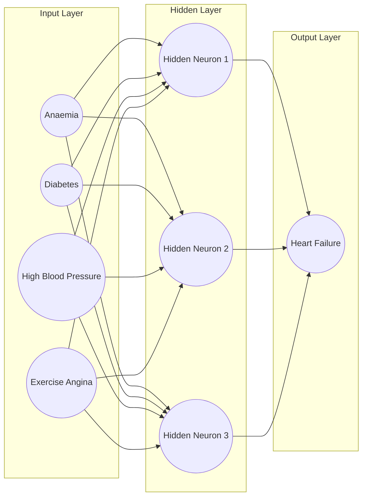

# BACS3074 MAY 2025 Answers

[Link to the paper](https://eprints.tarc.edu.my/32977/1/BACS3074.pdf)

- [Question 1](#question-1)
- [Question 2](#question-2)
- [Question 3](#question-3)
- [Question 4](#question-4)

> ![Note]
> View the diagrams in website that supports mermaid syntax, instead of mobile app.

## Answers

### Question 1

a)

|              | Turing Test                                                                                                                                                                                                                                                                                                                                                                              | Chinese Room                                                                                                                                                                                                                                                                                                                                                                                                                                                                                                                                   |
| ------------ | ---------------------------------------------------------------------------------------------------------------------------------------------------------------------------------------------------------------------------------------------------------------------------------------------------------------------------------------------------------------------------------------- | ---------------------------------------------------------------------------------------------------------------------------------------------------------------------------------------------------------------------------------------------------------------------------------------------------------------------------------------------------------------------------------------------------------------------------------------------------------------------------------------------------------------------------------------------- |
| Purpose      | An experiment to evaluate a machine's ability to exhibit intelligent behavior indistinguishable from a human.                                                                                                                                                                                                                                                                            | An experiment to argue that a machine executing a program cannot be said to "understand" the program's content.                                                                                                                                                                                                                                                                                                                                                                                                                                |
| How it works | <ol><li>A **human invigilator** interacts with both a **human respondent** and a **machine respondent** through a text interface.</li><li>Human and machine respondents **answer questions** posed by the invigilator.</li><li>If the invigilator cannot reliably **distinguish** between the human and machine responses, the machine is said to have passed the Turing Test.</li></ol> | <ol><li>A person who **does not understand** Chinese is inside a room with an **instruction manual** on answering questions in Chinese.</li><li>The person receives Chinese characters through a slot, uses the **manual** to **formulate appropriate responses**, and sends back Chinese characters through another slot.</li><li>To an outside observer, it appears as if the person inside the room understands Chinese, but in reality, they are merely **following syntactic rules** without any comprehension of the language.</li></ol> |

b)

i)

| **Goal Formulation** |                                                       |
| -------------------- | ----------------------------------------------------- |
| **Goal**             | Station I                                             |
| **Optimal Solution** | Arrive at Station I in the shortest distance possible |
| **Abstraction**      | The time taken to reach Station I                     |

| **Problem Formulation** |                                                            |
| ----------------------- | ---------------------------------------------------------- |
| **Initial State**       | Station A                                                  |
| **Successor Function**  | All steps allowing movement to connected adjacent stations |
| **Step Cost**           | Distance between stations (in KM)                          |

ii)

BFS



> BFS here uses early goal test, so it stops when the goal node I is generated instead of expanded.

A\*



iii)

|             | BFS                       | A\*                   |
| ----------- | ------------------------- | --------------------- |
| Search Path | A → B → C → D → E → F → H | A → C → D → F → H → I |
| Return Path | A → D → H → I             | A → D → H → I         |

### Question 2

a)

i) An AND-OR graph represents the reduced problems into **conjuctions and disjunctions of subproblems**, which is more suitable for rule-based knowledge that often involves multiple conditions and outcomes. In contrast, semantic networks is more suitable for **representing relationships between concepts**, while frames are better for representing structured knowledge about **objects and their attributes**, rendering them less effective in representing the dependencies and logical structures inherent in rule-based knowledge.

ii)



b)

i)

- Syntactic ambiguity is exists in sentence S, which is a type of ambiguity that arises from the structure or syntax of a sentence, leading to multiple possible interpretations.
- In this case, the phrase "with the knife" can be interpreted in two ways: it could suggest that the burglar used the knife to threaten the student, or it could imply that the student was carrying the knife when the burglar threatened them.

ii)





### Question 3

a)

i)

```
P(Yes) = 7/12
P(Anaemia|Yes) = 4/7
P(Diabetes|Yes) = 4/7
P(No High Blood Pressure|Yes) = 2/7
P(Exercise Angina|Yes) = 3/7
P(Yes|D) * P(D) = P(Anaemia|Yes) * P(Diabetes|Yes) * P(No High Blood Pressure|Yes) * P(Exercise Angina|Yes) * P(Yes)
                = 4/7 * 4/7 * 2/7 * 3/7 * 7/12
                = 0.023

P(No) = 5/12
P(Anaemia|No) = 1/5
P(Diabetes|No) = 2/5
P(No High Blood Pressure|No) = 3/5
P(Exercise Angina|No) = 2/5
P(No|D) * P(D) = P(Anaemia|No) * P(Diabetes|No) * P(No High Blood Pressure|No) * P(Exercise Angina|No) * P(No)
               = 1/5 * 2/5 * 3/5 * 2/5 * 5/12
               = 0.008
```

The patient is likely to have heart failure since P(Yes|D) > P(No|D).

ii)

Artificial Neural Network structure in mermaid:



b)

<!-- Accuracy = (88 + 73) / (88 + 73 + 4 + 10) = 0.92
Precision = 88 / (88 + 10) = 0.90
Recall = 88 / (88 + 4) = 0.96 -->

```
Accuracy  = (88 + 73) / (88 + 73 + 4 + 10)
          = 0.92

Precision = 88 / (88 + 10)
          = 0.90

Recall    = 88 / (88 + 4)
          = 0.96
```

### Question 4

a)

|       | 0   | 1   | 2   | 3   | 4   | 5   | 6   | 7   | 8   | 9   |
| ----- | --- | --- | --- | --- | --- | --- | --- | --- | --- | --- |
| **0** | 0   | 0   | 0   | 0   | 0   | 0   | 0   | 0   | 0   | 0   |
| **1** | 0   | 0   | 0   | 0   | 0   | 0   | 0   | 0   | 0   | 0   |
| **2** | 0   | 0   | 1   | 1   | 1   | 1   | 1   | 1   | 0   | 0   |
| **3** | 0   | 0   | 1   | 1   | 1   | 1   | 1   | 1   | 0   | 0   |
| **4** | 0   | 0   | 0   | 0   | 0   | 0   | 1   | 1   | 0   | 0   |
| **5** | 0   | 0   | 0   | 0   | 0   | 1   | 1   | 1   | 0   | 0   |
| **6** | 0   | 0   | 0   | 1   | 1   | 1   | 1   | 1   | 0   | 0   |
| **7** | 0   | 0   | 0   | 1   | 1   | 1   | 0   | 0   | 0   | 0   |
| **8** | 0   | 0   | 0   | 1   | 1   | 0   | 0   | 0   | 0   | 0   |
| **9** | 0   | 0   | 0   | 1   | 1   | 0   | 0   | 0   | 0   | 0   |

b)

```
R1: MIN(0.3, -0.4) * 0.8 = -0.32 Alzheimer
R2: MAX(0.75, 0.8) * 0.3 =  0.24 Alzheimer
R3: MIN(0.8, 0.6) * 0.75 =  0.45 Alzheimer

0.24 + 0.75 - (0.24 * 0.75) = 0.81 Alzheimer
(-0.32 + 0.81) / 1 - MIN(|-0.32|, |0.81|)
= 0.49 / 0.68
= 0.7206 Alzheimer
```

The Patient Z almost certainly has Alzheimer.

c) Fuzzy Logic can be used in air conditioners to maintain a comfortable room temperature. For example, if the temperature is hot, the speed of the fan can be set to high. If the temperature is cool, the speed of the fan can be set to low.
