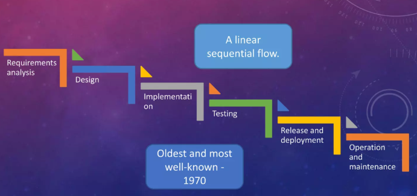
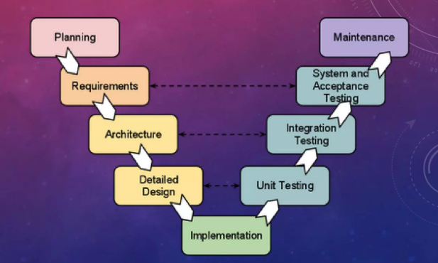
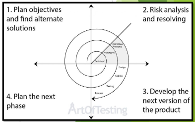
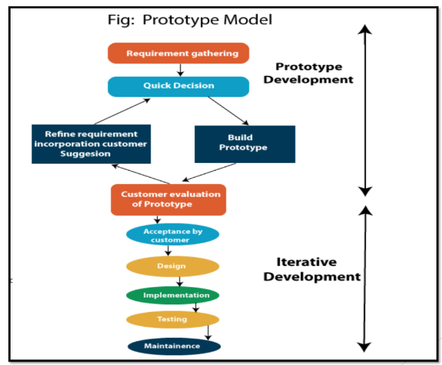
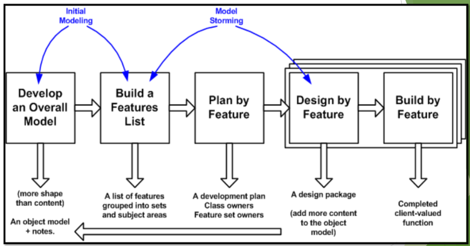
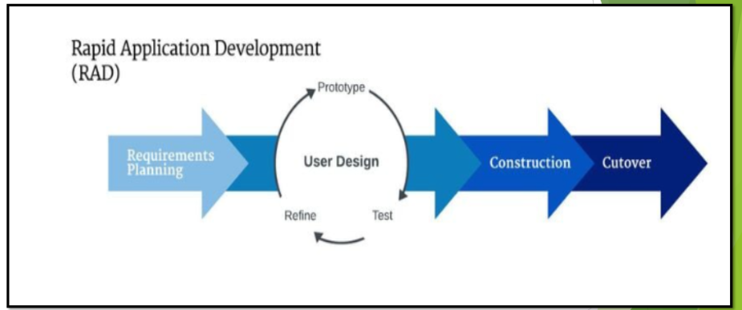

- [Chapter 1 Introduction to Software Engineering](#chapter-1-introduction-to-software-engineering)
  - [Glossary](#glossary)
  - [Benefits of Software](#benefits-of-software)
  - [Functions of Software](#functions-of-software)
  - [Characteristics of Software](#characteristics-of-software)
  - [Attributes of Good Software](#attributes-of-good-software)
  - [Layers of Software Engineering](#layers-of-software-engineering)
  - [Importance of Software Engineering](#importance-of-software-engineering)
  - [Key Challenges in Software Engineering](#key-challenges-in-software-engineering)
  - [Aspects of System](#aspects-of-system)
  - [System Engineering vs Software Engineering](#system-engineering-vs-software-engineering)
  - [Software Engineering Ethical Issues](#software-engineering-ethical-issues)
  - [ACM/IEEE Software Engineering Code of Ethics](#acmieee-software-engineering-code-of-ethics)
- [Chapter 2 Software Process Models](#chapter-2-software-process-models)
  - [Glossary](#glossary-1)
  - [Characteristics of Process](#characteristics-of-process)
  - [Importance of Process](#importance-of-process)
  - [Advantage of Software Process Model](#advantage-of-software-process-model)
  - [Software Processes](#software-processes)
  - [SDLC Models](#sdlc-models)
    - [Waterfall Model](#waterfall-model)
    - [V-Model](#v-model)
    - [Incremental Model](#incremental-model)
    - [Spiral Model](#spiral-model)
    - [Prototyping Model](#prototyping-model)
    - [Agile Models](#agile-models)
    - [Extreme Programming (XP)](#extreme-programming-xp)
    - [Feature-Driven Development (FDD)](#feature-driven-development-fdd)
    - [Rapid Application Development (RAD)](#rapid-application-development-rad)
  - [Summary of SDLC Models](#summary-of-sdlc-models)
- [Chapter 3 Project Management](#chapter-3-project-management)
  - [Glossary](#glossary-2)
  - [Importance of Project Management](#importance-of-project-management)
  - [Responsibilities of Project Manager](#responsibilities-of-project-manager)
  - [Project Management Activities](#project-management-activities)
    - [**Proposal Writing**](#proposal-writing)
    - [**Project Planning and Scheduling**](#project-planning-and-scheduling)
    - [**Project Costing**](#project-costing)
    - [**Project Monitoring and Reviews**](#project-monitoring-and-reviews)
    - [**Personnel Selection and Evaluation**](#personnel-selection-and-evaluation)
    - [**Report Writing and Presentations**](#report-writing-and-presentations)
- [Chapter 4 System Requirements](#chapter-4-system-requirements)
  - [User Requirements](#user-requirements)
  - [System Requirements](#system-requirements)
  - [Functional Requirements](#functional-requirements)
  - [Non-Functional Requirements](#non-functional-requirements)
  - [Problems with Natural Language](#problems-with-natural-language)
  - [System Requirements Specification](#system-requirements-specification)
  - [System Requirements Document](#system-requirements-document)
- [Chapter 5 Requirements Engineering Process](#chapter-5-requirements-engineering-process)
  - [Requirements Engineering Activities](#requirements-engineering-activities)
    - [Feasibility Study](#feasibility-study)
    - [Requirements Elicitation and Analysis](#requirements-elicitation-and-analysis)
    - [Requirements Validation](#requirements-validation)
    - [Requirements Management](#requirements-management)
  - [Viewpoint Oriented Analysis](#viewpoint-oriented-analysis)
- [Chapter 6 Architectural Design](#chapter-6-architectural-design)
  - [System Organisation](#system-organisation)
    - [Repository](#repository)
    - [Client-Server](#client-server)
    - [Layered](#layered)
  - [System Decomposition](#system-decomposition)
  - [Control Modelling](#control-modelling)
    - [Call-Return Model](#call-return-model)
    - [Manager Model](#manager-model)
    - [Broadcast Model](#broadcast-model)
    - [Interrupt-Driven Model](#interrupt-driven-model)
- [Chapter 7 Software Testing](#chapter-7-software-testing)
  - [Unit Testing](#unit-testing)
  - [Integration Testing](#integration-testing)
  - [System Testing](#system-testing)
  - [Acceptance Testing](#acceptance-testing)
  - [Source of Data](#source-of-data)
  - [Testing Strategies](#testing-strategies)
  - [Test Planning](#test-planning)
  - [Test Principles](#test-principles)
- [Chapter 8 User Interface Design](#chapter-8-user-interface-design)
  - [Human Factors in UI Design](#human-factors-in-ui-design)
  - [UI Design Issues](#ui-design-issues)
  - [Benefits of Good UI Design](#benefits-of-good-ui-design)
  - [Graphical User Interface](#graphical-user-interface)
  - [Interaction Styles](#interaction-styles)
  - [Information Presentation](#information-presentation)
  - [Colour Display](#colour-display)
  - [Message Design](#message-design)
  - [Error Messages](#error-messages)
  - [Support Documentations for Users](#support-documentations-for-users)
  - [Golden Rules of UI Design](#golden-rules-of-ui-design)
  - [UI Design Principles](#ui-design-principles)
- [Chapter 9 Real Time OS (RTOS)](#chapter-9-real-time-os-rtos)
  - [Characteristics](#characteristics)
  - [Components](#components)
  - [Categories](#categories)
  - [Timing Analysis](#timing-analysis)
  - [Stages of RTOS System Design](#stages-of-rtos-system-design)
  - [Stimuli](#stimuli)
- [Chapter 10 Software Evolution](#chapter-10-software-evolution)
  - [Process](#process)
  - [Software Maintenance](#software-maintenance)
  - [Maintenance Cost](#maintenance-cost)
  - [Why software maintenance more expensive than development?](#why-software-maintenance-more-expensive-than-development)
  - [Software Re-engineering](#software-re-engineering)
  - [Legacy System Management](#legacy-system-management)

# Chapter 1 Introduction to Software Engineering

### Glossary

- **Software**: A set of instructions that operates a computer (System Software) or performs a specific task (Application Software).
- **System Software**: Software operate, control and extend processing capabilities of computer hardware.
  - **System Control Software**: Controls execution of programs, manages storage, process resources of computer. OS
  - **System Support Software**: Provides support for system control software. UP
  - **System Development Software**: Tools for developing software. Compilers, Debuggers, Editors
- **Application Software**: Software that performs a specific task for the user, unrelated to computer operation.
  - **Generic Products**: General-purpose software for a wide audience. Word processors, Spreadsheets, Games
    - **Desktop Applications**: Installed on a single computer. Word processors, Spreadsheets
    - **Web Applications**: Accessed via a web browser. Online banking, E-commerce
    - **Mobile Applications**: Designed for mobile devices. Social media apps, Navigation apps
  - **Bespoke Products**: Tailored for specific user requirements.
- **Software Engineering**: An engineering discipline, concern with all aspects of software production.
  - From early stages of system specification to maintaining software after it has gone into use.
  - Applies theories, tools, and methods to discover solutions
  - Work within company constraints
  - **IMPORTANCE/GOAL: COST EFFECTIVE DEVELOPMENT OF SOFTWARE SYSTEMS**
- **System Engineering**: Interdisciplinary field, focuses on design and manage complex engineering projects.
  - Concern with issues such as logistics, coordination of different teams, and automatic control of machinery.

### Benefits of Software

- **Automation & Efficiency**: Reduce repetitive tasks, accomplish more in less time.
- **Accuracy & Reliability**: Minimize human error, ensure consistent and reliable results.
- **Scalability & Flexibility**: Scale up or down easily to meet changing demands, adapt to new requirements.
- **Improved Decision Making**: Provide data analysis and insights.
- **Inovation and Competitive Advantage**: Enable new products and services, differentiate from competitors.
- **Improved Customer Experience**: CRMs enable better customer service, personalized experiences.
- **Cost Savings**: Reduce operational costs.
- **Accessibility & Convenience**: Cloud services and mobile apps provide access from anywhere, anytime.
- **Continuous Improvement and Updates**: Can be updated and improved over time to meet evolving needs.

### Functions of Software

- **Manage** computer resources
- **Provide Tools** for human to take advantage of computer resources
- **Intermediary** between organisation and stored information

### Characteristics of Software

- **Developed or engineered**: Not manufactured in the traditional sense.
- **Does not wear out**: Unlike hardware, software does not degrade over time.
- **Custom to be built**: Software is often tailored to specific needs.

### Attributes of Good Software

- **Availability**: Work as required when needed.
- **Functional**: Perform required functions.
- **Efficient**: Efficient use of time and resources.
- **Reliable**: Not prone to failure, deliver consistent results.
- **Secure**: Protect against error, attacks, and loss.
- **Flexible**: Adapt to new uses, run in different countries or platforms.
- **Buildable**: Not too complex to implement.
- **Manageable**: Easy to estimate work and track progress.
- **Maintainable**: Easy to understand design intentions, modify, and extend.
- **Usable**: Provide satisfying experience for users.
- **Reusable**: Elements can be reused in other systems.

### Layers of Software Engineering

- **Quality Focus**: Prioritizing high standards in work and products, strive for best outcomes.
  > - Quality focus example: Effort to define metrics to measure quality, implement peer reviews, unit testing, continuous integration etc.
- **Process**: Define a framework for a set of KPAs (Key Process Areas) to be performed in a project for effective delivery
  - **KPAs**: Specific areas of focus in software development, such as requirements management, design, coding, testing, and maintenance.
    > - Process example: Agile, Waterfall, Spiral, V-Model
- **Methods**: Organised way to produce software - Include suggestions for the process to be followed, notations to be used, rules governing system description, produced and design guidelines
  > - Methods example: UML, Design Patterns, Test-Driven Development (TDD)
- **Tools**: Automated or semi-automated support for the process and methods
  > - Tools example: Version control systems (Git), Integrated Development Environments (IDEs), Testing frameworks (JUnit, Selenium)

### Importance of Software Engineering

- **Reliable Products**
- **Adhere to Schedule**
- **Meeting user requirements**
- **Avoiding budget overruns**
- **Ensuring optimal performance**
- **Facilitating maintainability**

### Key Challenges in Software Engineering

- **Delivery**: Delivering software on time without compromising quality.
- **Legacy**: Maintaining and updating legacy systems avoiding excessive costs and ensuring essential functionality.
- **Heterogeneity**: Cope with diverse computer and system environments.

### Aspects of System

- **Hardware**
- **Software**
- **Database**
- **People**
- **Network**

  ### System Engineering vs Software Engineering

| System Engineering                                                                  | Software Engineering                                                                     |
| ----------------------------------------------------------------------------------- | ---------------------------------------------------------------------------------------- |
| Interdisciplinary field deals with all aspects of computer-based system development | Subset of system engineering, discipline concern with all aspects of software production |
| Identify roles of hardware, software, people etc. (above)                           | Tell practicalities of develop and delivering useful software                            |

### Software Engineering Ethical Issues

- **Confidentiality**: Protecting sensitive information regardless of whether a formal confidentiality agreement exists.
- **Competence**: Not representing oneself as an expert in a field without the necessary knowledge and skills.
- **Intellectual Property Rights**: Aware of local laws governing intellectual property rights and respecting them.
- **Computer Misuse**: Not using software for illegal or unethical purposes, such as hacking or distributing malware.

### ACM/IEEE Software Engineering Code of Ethics

- **Public**: Act consistently with the public interest.
- **Client and Employer**: Act in the best interests of the client and employer, consistent with the public interest.
- **Product**: Ensure products meet the highest professional standards possible.
- **Judgment**: Maintain integrity and independence in professional judgment.
- **Management**: Promote an ethical approach to the management of software development and maintenance.
- **Profession**: Advance the integrity and reputation of the profession consistent with the public interest.
- **Colleagues**: Be fair to and supportive of colleagues.
- **Self**: Participate in lifelong learning regarding the practice of the profession and promote an ethical approach to the practice of the profession.

# Chapter 2 Software Process Models

### Glossary

- **Process**: A series of steps taken to produce intended output.
  - Steps involves activities, constraints, and resources.
  - Process involves tools and techniques
- **Software Process**: A structured set of activities required to develop a software system.
- **Software Process Model**: An abstract representation of a software process, describing the activities involved in software development.

### Characteristics of Process

- Uses resources
- Produce intermediate and final products
- May compose of sub-processes with hierarchical structure
- Organised in sequence
- Constraints may apply to the activities, resources, and products

### Importance of Process

- **Consistency and structure** on set of activities
- **Understand and improves** the activities
- **Capture** the experience and pass along

### Advantage of Software Process Model

- **Increase development productivity**
- **Improve product quality**
- **Improve tracking and control**
- **Improve client relations**
- **Reduce risk**
- **Reduce overhead in project management**

### Software Processes

- **Software Specification**: Develop detailed description of the software system to be developed.
  - **Functional and Non-functional Requirements**
- **Software Development**: Design, program, document, test, and debug the software.
- **Software Validation**: Ensure the software meets business requirements and user needs
- **Software Evolution**: Timely updates and enhancements to the software after it has been deployed.

### SDLC Models

- **Predictive Models**: Plan-driven Models, planning first, execution later
- **Adaptive Models**: Agile Models, iterative and incremental development, adapt to changes

|                     | Predictive Models                                            | Adaptive Models                                 |
| ------------------- | ------------------------------------------------------------ | ----------------------------------------------- |
| Requirements        | Known early, largely stable                                  | Rapidly changing, evolving                      |
| Refactoring         | Expensive                                                    | Inexpensive                                     |
| Primarily Objective | High assurance (Certainty)                                   | Rapid value (Adaptability)                      |
| Customers           | Knowledgeable                                                | Dedicated                                       |
| Development         | Plan-oriented, adequate skills, access to external knowledge | Agile, knowledgeable, collocated, collaborative |
| Architecture        | Designed for current and foreseeable requirements            | Designed for current requirements               |
| Size                | Large, complex systems                                       | Small to medium systems                         |
| Example             | Waterfall, V-Model, Spiral                                   | XP, FDD, RAD                                    |

#### Waterfall Model



- **Plan-Driven Model**
- **Highlights**
  - Linear sequential model
  - Each phase must be completed before the next begins
  - Does not allow for going back to previous phases
- **Phases**
  - **Requirements**: Functional Specification includes requirements, deadlines, and guidelines
  - **Analysis**: Generate product model and business logic to guide production. Feasibility study.
  - **Design**: Programming language, hardware, data sources, architecture and services
  - **Coding and Implementation**
  - **Testing**: Unit testing, integration testing, system testing, acceptance testing
  - **Operation and Deployment**
  - **Maintenance**: Corrective, adaptive, perfective, preventive
- **Choose When**
  - Fixed Requirements
  - Rich Resources
  - Established Timeline
  - Well-Understood Technology
  - Unlikely requires significant changes
- **Advantages**
  - Enable large and changing team to work together for common goals
  - Forces structure and discipline
  - Clearly defined milestones and deadlines
- **Disadvantages**
  - Not adaptive/flexible
  - Delays testing until the end
  - Not ideal for complex or high risk projects
  - No working software until the end

#### V-Model



- **Plan-Driven Model**
- **Highlights**
  - Extension of Waterfall Model
  - Emphasizes verification and validation
  - Each development phase has a corresponding testing phase
- **Phases**
  - **Requirements Gathering and Analysis**: Analyze customer requirements and determine project scope
  - **Design**: Design high-level architecture and detailed design
  - **Implementation**: Code the software based on design specifications
  - **Testing**
  - **Deployment**
  - **Maintenance**
- **Choose When**
  - Software requirements clearly defined and known
  - Software development technologies and tools are well understood
- **Advantages**
  - Validation in early stages of development
  - Easy to understand and use
  - Each phase has specific deliverables
- **Disadvantages**
  - Not suitable for dynamic changes in requirements (Expensive to change)
  - Costly and requires more time
  - Needs proper and detailed planning
  - No continuous customer involvement

#### Incremental Model


- **Plan-Driven Model**
- **Highlights**
  - Breaks down software requirements into smaller, manageable increments
  - Each module has its own requirements, design, implementation, and testing
- **Phases**
  - **Requirements Analysis**: Plan only made for the next increment, easier to adapt to changes
  - **Design and Development**: Higher tolerance for changes (Smaller scope), usually develop each increment with iterative waterfall model.
    - Develop core functionality first, then add additional features in subsequent increments
  - **Deployment and Testing**: Each increment is deployed and tested
  - **Implementation**: Deploy the whole system after all increments are completed
- **Choose When**
  - Major requirements are defined, but details can evolve
  - Need to deliver working software quickly
  - New technology or tools are being used
  - Resources are limited
- **Advantages**
  - Generate working software quickly
  - More flexible to changes (Less costly to change)
  - Easier to test and debug smaller increments
  - Lower initial delivery cost
  - Easier to manage risk as each risk is handled in smaller increments
- **Disadvantages**
  - Requires good planning and design
  - Need complete definition of the whole system before breaking it into increments

#### Spiral Model



- **Plan-Driven Model**
- **Highlights**
  - Risk-driven model, Cyclic model
  - Combines iterative development with the systematic aspects of the waterfall model
  - Focuses on risk assessment and reduction
- **Phases**
  - **Objective Definition**: Define objectives, including functional and non-functional requirements
  - **Risk Analysis**: Identify and evaluate risks, develop strategies to mitigate them
  - **Engineering**: Design, develop, and test the software
  - **Evaluation**: Evaluate the software and gather feedback
  - **Planning**: Plan the next iteration based on feedback and lessons learned
- **Choose When**
  - Large, complex, and **high-risk** projects
  - Frequent Deliverances
  - Unclear requirements
  - Large and high budget projects
- **Advantages**
  - Risk Handling
  - Flexible to changes: Can adapt changes in next phase
  - Iterative and incremental development
  - Improved customer involvement
  - Improved quality of software
- **Disadvantages**
  - Complex
  - Expensive
  - Requires expertise in risk assessment (High dependability on risk analysis)
  - Time estimation is difficult
  - Time-consuming

#### Prototyping Model



- **Highlights**
  - Focuses on building a prototype before developing the final product
  - Prototypes are incomplete versions of the software
  - Works when not all requirements are known in detail ahead of time
- **Phases**
  - **Requirements Gathering and Analysis**
  - **Quick Design**
  - **Build Prototype**
  - **Initial User Evaluation**
  - **Refine Prototype**
  - **Implmentation and Maintenance**
- **Choose When**
  - Customer don't know exactly what they want
  - Developer new to the domain
  - The prototype can be the basis for the final product
- **Advantages**
  - Easily accommodate requirements changes
  - Early error detection
  - Prototype can be reuse in other projects
  - Provide confidence to the customer
- **Disadvantages**
  - Poor documentation
  - Hard to accommodate all changes demanded
  - Uncertain of the iteration needed
  - Customer may urge for the prototype to be the final product
  - Customer might lose interest in the final product if the prototype is not satisfactory
- **Types of Prototypes**
  - **Throwaway Prototyping**: Quickly built, not intended to be part of the final product. Used to gather requirements and feedback.
  - **Evolutionary Prototyping**: Built incrementally, refined through iterations, and eventually becomes the final product.
  - **Incremental Prototyping**: Combines both throwaway and evolutionary prototyping. Develops the system in increments, each increment is a prototype that evolves into the final product. The final product is built by integrating the increments.
  - **Extreme Prototyping**: Used in web development, consists of three phases: creating a static model of the user interface, developing the services layer, and integrating the two.

#### Agile Models

- Focus on continuous delivery of small, functional software increments
- **Advantages**
  - More interaction within developing team and testing team
  - Customer can change or add requirements at any time
- **Disadvantages**
  - Documentation could get lengthy
  - Not useful for small projects
  - More costly than other models
- **Principles**

  - **Customer satisfaction** by rapid delivery of useful software
  - Welcome **changing requirements**, even late in development
  - Working software is **delivered frequently** (weeks rather than months)
  - **Sustainable** development, able to maintain a constant pace
  - **Close, daily cooperation** between business people and developers
  - **Face-to-face conversation** is the most efficient and effective method of conveying information
  - Projects are built around **motivated individuals**, who should be trusted
  - Continuous attention to **technical excellence and good design**
  - Simplicity - the art of maximizing the amount of work not done - is essential.

    > The Agile principle of simplicity, often stated as "the art of maximizing the amount of work not done," emphasizes focusing on delivering the most valuable features with the least amount of effort. It's about choosing the simplest solution that meets the immediate needs, rather than trying to anticipate every possible future requirement. This approach minimizes complexity, reduces waste, and allows for greater flexibility and adaptability.

  - **Self organizing teams**
  - Regular adaptation to **changing circumstances**

#### Extreme Programming (XP)


- **Adaptive Model**
- **Highlights**
  - Values communication, feedback, simplicity, courage, and respect
- **Phases**
  - **Planning**: Identify user stories, prioritize them, and estimate effort.
  - **Design**: Design code architecture, deciding programming language, environment, libraries and frameworks.
  - **Coding**: Iteratively develop the software, test regularly
  - **Testing**: Write automated tests to ensure code works as expected
- **Choose When**
  - Rapidly changing requirements
  - Tight deadlines
  - Team can automate testing
- **Advantages**
  - Simple code
  - Constant testing
  - Uplift team morale
- **Disadvantages**
  - More attention to coding than design
  - Not working with remote teams
  - Requires detailed documentation to ensure knowledge transfer and avoid repeating issues

#### Feature-Driven Development (FDD)



- **Adaptive Model**
- **Highlights**
  - Client centric
  - Focuses on incremental development and status reporting across all levels
  - Short iterations (2-10 days per feature)
- **Phases**
  - **Develop Overall Model**: Determine project, propose multiple models and merge them to create an overall model.
  - **Build Feature List**: Identify features (small, client-valued functions)
  - **Plan by Feature**: Prioritize features, assign them to teams, and estimate effort.
  - **Design by Feature**: Create design packages for each feature for review and consensus.
  - **Build by Feature**: Implement features in short iterations and test them.
- **Choose When**
  - Large-scale projects with large team
  - Well-defined features
- **Advantages**
  - Focus on client needs
  - Clear picture of the project scope
  - Decrease need for meetings
- **Disadvantages**
  - Not suitable for small projects
  - Dependence on lead developer
  - No written documentation for clients

#### Rapid Application Development (RAD)



- **Adaptive Model**
- **Highlights**
  - Focuses on rapid prototyping and iterative development
  - Emphasizes user feedback and involvement
- **Phases**
  - **Requirements Planning**: Gather requirements, define scope, and plan the project.
  - **User Design**: Create prototypes, gather user feedback, and refine requirements.
  - **Rapid Construction**: Leverage prototypes to build the final product
  - **Cutover**: Finalize the product, conduct user acceptance testing, and deploy.
- **Choose When**
  - When the system needs to be developed quickly (2-3 months)
  - Requirements are well-known
  - Limited technical risk
  - Budget allows code generation tools to speed up development
- **Advantages**
  - Each phase brings highest priority features to the user
  - Reduced development time through prototyping
  - Increase reusability of features
  - Flexible to changes
- **Disadvantages**
  - Requires skilled designers
  - Not suitable for small projects or high technical risk projects
  - Requires user involvement

### Summary of SDLC Models

| Model                  | Type        | Key Features                                                                                    | Advantages                                                                        | Disadvantages                                                                               |
| ---------------------- | ----------- | ----------------------------------------------------------------------------------------------- | --------------------------------------------------------------------------------- | ------------------------------------------------------------------------------------------- |
| Waterfall              | Plan-Driven | Linear sequential, no going back, clear milestones                                              | Structured, discipline, clear deadlines                                           | Not adaptive, no working software until the end                                             |
| V-Model                | Plan-Driven | Emphasizes verification and validation, each phase has a corresponding testing phase            | Validation in early stages, easy to understand                                    | Not suitable for dynamic changes, costly, no continuous customer involvement                |
| Incremental            | Plan-Driven | Breaks down software into smaller increments, each with its own requirements                    | Generate working software quickly, flexible to changes                            | Requires good planning and design, need complete definition of the whole system             |
| Spiral                 | Plan-Driven | Risk-driven, combines iterative development with systematic aspects of waterfall                | Risk handling, flexible to changes, improved customer involvement                 | Complex, expensive, requires expertise in risk assessment                                   |
| Prototyping            |             | Focuses on building a prototype before final product, works when not all requirements are known | Easily accommodate requirements changes, early error detection                    | Poor documentation, hard to accommodate all changes demanded                                |
| Extreme Programming    | Adaptive    | Values communication, feedback, simplicity, courage, and respect                                | Simple code, constant testing, uplift team morale                                 | More attention to coding than design, not working with remote teams                         |
| Feature-Driven Dev.    | Adaptive    | Client centric, focuses on incremental development and status reporting                         | Focus on client needs, clear picture of project scope                             | Not suitable for small projects, dependence on lead developer                               |
| Rapid Application Dev. | Adaptive    | Focuses on rapid prototyping and iterative development                                          | Each phase brings highest priority features to the user, reduced development time | Requires skilled designers, not suitable for small projects or high technical risk projects |

# Chapter 3 Project Management

### Glossary

- **Project**: A problem scheduled for solution
- **Project Management**: The process of planning, monitoring, and control of people, processes and events that occur as software evolves from preliminary concept to an operational implementation.

### Importance of Project Management

- **Handle Project Effectively**
- **Plan resources**
- **Estimate costs**
- **Plan and schedule activities**
- **Allocate resources**
- **Assess risks**
- **Effectively communicate with stakeholders**

### Responsibilities of Project Manager

- **Plan and Schedule** project development
- **Supervise** work to ensure standard
- **Monitor progress** to ensure project is on time and within budget

### Project Management Activities

#### **Proposal Writing**

- Define project goals, identify tasks, estimate resources needed, create a timeline of completion
- Ensure all stakeholders understand the scope, objectives, and deadlines
- Allocate resources and setting milestones

#### **Project Planning and Scheduling**

- Deliverables
  - Preliminary Investigation Report
  - Requirements Specification Document
  - Design Specification Document
  - Prototype
  - Gantt Chart

#### **Project Costing**

- Estimate and track expenses
- Control the project to be financially viable
- **Direct Cost**: Materials, labor, equipment
- **Indirect Cost**: Overhead, administrative expenses
- **Resource**: Hardware, software, human resources

#### **Project Monitoring and Reviews**

- Track progress, identify deviations from the plan, and take corrective actions
- Review: Evaluate project performance against predefined metrics
- Tools: KPI (Key Performance Indicators), Progress Reports, Status Meetings
- **Constraints**:
  - **Scope**: what the project will deliver
  - **Time**: project schedule and deadlines
  - **Budget**: Cost and financial resources
    - Human resources, materials, equipment
- **Corrective Actions**: Adjust staff, reassign tasks, using OT

#### **Personnel Selection and Evaluation**

- Identify and recruit the right people for the project
- Assess team members performance, provide feedback, make decisions on promotions or role changes
- **Factors** to consider:
  - Application Domain
  - Experience
  - Attitude
  - Communication Skills
  - Adaptability
- **Maslow's Hierarchy of Needs**: Understand team members' needs to motivate them effectively
  - **Physiological Needs**: Basic needs like food, water, shelter
  - **Safety Needs**: Job security, safe working environment
  - **Belongingness and Love Needs**: Social connections, teamwork
  - **Esteem Needs**: Recognition, respect, achievement
  - **Self-Actualization Needs**: Personal growth, fulfilling potential
- **Factors influencing Group Working**:
  - **Group Composition**: Right mix of skills, experience and personalities in the team
    - Self-Oriented: Focus on personal goals
    - Task-Oriented: Focus on achieving project goals
    - Interaction-Oriented: Focus on team dynamics and communication
  - **Group Cohesiveness**: The degree to which team members are connected and work well together. Strong mutual respect, trust, and shared goals.
  - **Group Communication**: Exchange of information and ideas within the team. Effective communication fosters collaboration and reduces misunderstandings.
  - **Group Organization**: Assign right roles and responsibilities to team members. Team members feel valued and motivated when they have clear roles.

#### **Report Writing and Presentations**

- Communicate project progress and key findings to stakeholders

# Chapter 4 System Requirements

- Requirements: Set out what the system **should do** and **constraints** on its operation

### User Requirements

- High level, abstract
- From user & people procuring the system
- Natural language, diagrams, tables

### System Requirements

- Extend the user requirements, more precise and detailed
- From developers and testers
- Structured natural language, system models, tables
- Starting point for system design (Functional Specification)
- Contract between developer and customer
- Format: "The system shall ..."

### Functional Requirements

- Services provided
- How system react to input
- How the system behave to situations
- What system should and should not do

### Non-Functional Requirements

- Types:
  - **Product requirements**: Result from the need for the system to behave in a particular way
  - **Organizational requirements**: Consequences of organizational policies and procedures
  - **External requirements**: From factors external to the system and its development process
- The "How" rather than the "What"
- Quality attributes, performance criteria, and constraints

```
Non-Functional Requirements
 |
 +-- Product Requirements
 |    +-- Usability
 |    +-- Performance
 |    +-- Reliability
 |    +-- Space
 |    +-- Portability
 |
 +-- Organizational Requirements
 |    +-- Delivery
 |    +-- Implementation
 |    +-- Standards
 |
 +-- External Requirements
      +-- Interoperability
      +-- Ethical
      +-- Legislative
      +-- Privacy
      +-- Safety
```

### Problems with Natural Language

- **Lack of Clarity**: Ambiguous terms, wordy, complex and difficult to read
- **Requirements Confusion**: Mixing functional and non-functional requirements, system goals and design info, inconsistent terminology
- **Amalgamation**: Single requirement may specify several different system functions

### System Requirements Specification

- Structured Natural Language: Use of templates and standard formats to improve clarity and consistency
- Design Description Language (DDL): Formal language for describing system architecture
- Graphical Notations: UML diagrams, ER diagrams etc.
- Mathematical Specifications: Formal methods, Z notation etc.

### System Requirements Document

- Include user and system requirements
- Not design document, no need the "how"
- Should be complete, consistent, no contradictions, verifiable, modifiable, traceable
- Stakeholders: Customers, Engineers, Test Engineers, Project Managers, Maintenance Engineers

# Chapter 5 Requirements Engineering Process

- Requirements Engineering: Process of all activities required to create and maintain SRD

### Requirements Engineering Activities

- [Feasibility Study](#feasibility-study)
- [Requirements Elicitation and Analysis](#requirements-elicitation-and-analysis)
- [Requirements Specification (Chapter 4)](#chapter-4-system-requirements)
- [Requirements Validation](#requirements-validation)
- [Requirements Management](#requirements-management)

#### Feasibility Study

- **L**egal Feasibility - Compliance with laws and regulations
- **O**perational Feasibility - Is the scope of the project within the organisation's capabilities?
  - How it impact the existing daily operations
- **T**echnical Feasibility - Technically possible to build the system?
  - Availability of tools and expertise
- **E**conomic Feasibility - Financially viable?
  - Rough Order of Magnitude (ROM) Estimate - Quick estimate based on similar projects
- **S**cheduling Feasibility - Can the project be completed within the required timeframe?

#### Requirements Elicitation and Analysis

- Process deriving the system requirements
- Discuss with stakeholders
- Challenges:
  - Stakeholders not clear about what they want
  - Stakeholders use own terminology
  - Different stakeholders express requirements in different ways
  - Political and organisational factors
  - Changing requirements due to economic or business environment changes
- Activities:
  - **Requirement Discovery**: From stakeholders, documents and similar systems
    - Viewpoint-oriented analysis
    - Techniques: Interviews, Prototyping, Scenario, Observation
  - **Requirement Classification and Organization**: Cluster related requirements, remove overlapping requirements
  - **Requirement Prioritization and Negotiation**: Rank requirements to resolve conflicts through negotiation
  - **Requirement Documentation**: Complete, consistent and in accordance with stakeholders' needs

#### Requirements Validation

- Process checking that the defined requirements are what the customer really wants
- Aspects:
  - **Validity**: Correctness of requirements, is needed by the customer
  - **Consistency**: No conflicts between requirements
  - **Completeness**: All necessary functions and constraints are included
  - **Realism Check**: Can be implemented (with existing technology, budget, and schedule)
  - **Verifiability**: Measurable, testable and traceable
- Methods:
  - **Prototyping**
  - **Structured Walkthroughs**: Review of requirements by a team
  - **Formal Technical Reviews**: Peer review of requirements

#### Requirements Management

- Process of validating and meeting the needs of customer and external and internal stakeholders
- **Management Planning**: Define project objectives, roles and responsibilities, etc. to govern the requirements management policy and procedures
- **Change Management**: Proposed changes are analyzed and their impact on the project is assessed

### Viewpoint Oriented Analysis

- Viewpoints
  - **Interactor**: Interact directly with the system
    - Users
  - **Indirect**: Affect the system but do not interact with it directly
    - External organisations
    - Competitor systems
    - Management
  - **Domain**: Domain constraints
    - Regulatory authorities
    - UI standards
- Advantages
  - Broad stakeholder coverage
  - Relatively easy to decide if some agent is or is not a valid viewpoint
- Disadvantages
  - Time consuming
  - Tedious
  - Costly

# Chapter 6 Architectural Design

- Establish framework for control and communication among sub-systems identified during requirements analysis
- First stage before detailed system design specification
- Advantages
  - Stakeholder communication
  - Ease system analysts' task to validate if requirements are met
  - Large scale reuse: component designs can be reused in other systems
  - Negotiation and discussion
  - Complexity Management
- Activities
  - [System Organisation](#system-organisation)
  - [Modular Decomposition](#modular-decomposition)
  - [Control Modelling](#control-modelling)

### System Organisation

- Block Diagram: Each block represents a sub-system, lines represent communication
- System structured into **principal sub-systems** (independent software units)
- Design how subsystems interact
  - Interface
  - Distribution
  - Data Sharing
- Common models
  - **[Repository](#repository)**
  - **[Client-Server](#client-server)**
  - **[Layered](#layered)**

#### Repository

- Central Database
- Usage: Large amounts of shared data
- All shared data held in a central database, accessed by all sub-systems
- Advantages:
  - Efficiently share large amounts of data
  - Centralized management of data
  - Sharing model is published as repository schema
  - Subsystems do not need to concern how data is produced
- Disadvantages:
  - Difficult to distribute
  - Subsystem compromised on single database schema
  - Difficult and expensive data evolution
  - No scope for specific management policies

#### Client-Server

- Distributed System
- Data and processing distributed across multiple components
- Set of standalone servers provide services to multiple clients
- Clients make requests to servers, servers process requests and return results
- Advantages:
  - Distribution of data is straightforward
  - Effective network system, cheaper hardware
  - Easy to add or upgrade servers
- Disadvantages:
  - Inefficient data sharing due to different data model
  - Redundant Management
  - No central register of names and services (Hard to locate available services)

#### Layered

- Abstract Machine Model
- Organise system in set of layers
- Support incremental development
- Only adjacent layers are affected by changes

### System Decomposition

- Further decompose sub-systems into modules
- **Object-Oriented Decomposition**
  - Decompose system into interacting objects
- **Functional Decomposition**
  - Data flow model, pipeline of functions, one function output is another function input

### Control Modelling

- Control the subsystems, so the services are delivered to the right place and right time
- Centralized Control
  - One subsystem controls the execution of others
  - [Call-Return Model](#call-return-model)
  - [Manager Model](#manager-model)
- Event-Based Control
  - Respond to events from other subsystems or environment
  - [Broadcast Model](#broadcast-model)
  - [Interrupt-Driven Model](#interrupt-driven-model)

#### Call-Return Model

- Top down subroutine invocations
- **Sequential** system

#### Manager Model

- **Concurrent** system
- Manager controls the stopping, starting and synchronisation of other subsystems

#### Broadcast Model

- Event broadcast to all subsystems, only interested subsystems handle and respond to the event
- Effective in **integrating sub-systems distributed across computers on a network**

#### Interrupt-Driven Model

- Used in **Real-Time** systems
- Interrupt detected by interrupt handler and passed to some other component for processing

# Chapter 7 Software Testing

- **Validation Testing**: Ensure the system meets the requirements and works as expected
- **Defect Testing**: Discover faults and defects in the system
- Level of Testing
  - **[Unit Testing](#unit-testing)**
  - **[Integration Testing](#integration-testing)**
  - **[System Testing](#system-testing)**
  - **[Acceptance Testing](#acceptance-testing)**

### Unit Testing

- Test individual units/components, typically at the function level
- Carried out by developers
- Verify that **the unit/component functions as intended and coded correctly**

### Integration Testing

- Test **interface** between two software units/modules
- Expose faults in the interaction between integrated units
- Carried out by developers
- **Techniques**
  - **Top-Down**: Test high level integration first, gradually replace lower level stubs with real modules
  - **Bottom-Up**: Test low level integration first, gradually replace higher level drivers with real modules
  - **Regression Testing**: Retest the system after changes to ensure no new faults are introduced (Expensive testing)

### System Testing

- Evaluate overall functionality and performance of the complete system
- Test if **requirements are met** and if the system is **ready for delivery**
- Carried out by an independent testing team

### Acceptance Testing

- Validate if the system is acceptable for operational use
- Final stage of development before delivery
- Carried out by the end users
- **Techniques**
  - **Beta Testing**: Deliver the system to a limited number of users to use in their own environment, expose faults found in real-world usage
  - **Black Box Testing**: Test system functionality without knowledge of internal workings, study the input and output
  - **Performance/Stress Testing**: Test using intended workload and overload conditions to evaluate performance and stability
  - **Back-to-Back Testing**: Compare the output of the new system with the output of an existing system for the same input data

### Source of Data

- **Live Data**: From DB, input from normal activities
  - Hard to obtain sufficient amount of data to conduct extensive testing
- **Artificial Data**: Generated data
  - Test all combinations of input data
  - Use data generating utility programs

### Testing Strategies

- **Proactive Testing**
  - Take anticipatory actions to prevent defects occurring in the first place
  - Plan, prepare and think strategically to mitigate risks
  - Implement automated testing processes, code reviews and static code analysis tools
  - Create test plan from requirements analysis
- **Reactive Testing**
  - Respond to defects found during testing
  - Bug tracking systems to prioritize and assign developers to fix bugs
  - Post-mortem analysis to identify root causes of defects and implement corrective actions

### Test Planning

- Setting out **standard** for testing
- Includes
  - Testing Process (unit, integration, system, acceptance)
  - Traceability (link tests to requirements)
  - Tested Items (Program modules, user procedures, etc.)
  - Testing Schedule (Gantt chart)
  - Testing Recording Procedures (Test case ID, description, expected results, actual results, pass/fail status)
  - Hardware and Software Requirements
  - Constraints (Time, test item availability, etc.)
- Approaches of test case design
  - **Requirements-based**
  - **Partition Testing**: Identify input and output partitions, so the system executes inputs from all partitions and generates outputs in all partitions
  - **Structural Testing**: Use knowledge of the program structure to design test cases so it covers all parts of the program

### Test Principles

- All tests should be **traceable** to customer requirements
- Tests should be **planned long before** testing begins
- **Pareto Principle** is applied to software testing
  - 80% of defects found are likely to be found in 20% of the modules
  - Isolate suspect modules and focus testing effort on them
- Testing should begin in **small** and progress towards **larger scale** tests
- Exhaustive testing is **impossible**
  - Impossible to test all paths during testing (white box testing)
- To be most effective, testing should be **conducted by an independent** third party
  - Developers may be biased and overlook defects in their own code

# Chapter 8 User Interface Design

### Human Factors in UI Design

- **Limited Short-Term Memory**: Humans can only remember a small number of items (7±2)
- **People make mistakes**: Inappropriate alarms and messages may increase stress and lead to more mistakes
- **People differ**: People have wide range of physical and mental capabilities
- **People has different interaction preferences**: Some like pictorial interfaces, some like textual interfaces

### UI Design Issues

- How should information from the user provided to the system?
- How should information from the system presented to the user?

### Benefits of Good UI Design

- Small improvement worths big money
- Interface problems treated as bugs
- New UI design can establish a new product

### Graphical User Interface

- Characteristics
  - **Windows**
  - **Icons**
  - **Menus**
  - **Pointing**
  - **Graphics**
- Advantages
  - Easy to learn and use
  - User can switch between tasks
  - Fast, full-screen interaction is possible
- Disadvantages
  - Poorly designed interfaces can be confusing and cause catastrophic errors

### Interaction Styles

| Interaction Style       | Advantages                                | Disadvantages                                                                  | Application Areas            |
| ----------------------- | ----------------------------------------- | ------------------------------------------------------------------------------ | ---------------------------- |
| **Direct Manipulation** | Fast interaction, easy to learn           | Hard to implement, only suitable where there is a visual metaphor for the task | Video Games, CAD             |
| **Menu Selection**      | Avoids user error, little typing required | Slow even for expert users, can be complex                                     | Most general-purpose systems |
| **Form Fill-in**        | Simple data entry, easy to learn          | Takes up lots of screen space                                                  | Stock control                |
| **Command Language**    | Powerful, flexible                        | Hard to learn, poor error handling                                             | OS                           |
| **Natural Language**    | Easy to learn, flexible                   | Very difficult to implement, error-prone                                       | Limited domain applications  |

### Information Presentation

- Present information in a way that is easy to understand
- Type of information
  - **Static information**: Initialise at beginning of session, does not change during session
  - **Dynamic information**: Changes during the session and must be communicated to the user
- Display Factors
  - If user interested in precise information or data relationships
  - How quickly the information changes, how quickly the change need to reflect on the display
  - Must user take action respond to the change
  - Does the user need to interact via direct manipulation interface
  - Is information textual or numeric? Are relative values important?
- Type of presentation
  - **Digital Presentation**: Compact and precise, in text or numeric form
  - **Analog Presentation**: More intuitive, shows relative values, in graphical form
- **Data Visualisation**: Technique for displaying large amount of information

### Colour Display

- Help understand complex structure and highlight exceptional events
- Rules for using colour
  - Avoid using too many colours
  - Allow user control colour coding
  - Design for monochrome first then add colour
  - Avoid clashing colours
  - Use colour to show status change
  - Aware for colour blindness issues by using redundant coding (e.g., shape, position)

### Message Design

- **Context**: Adjust message content and level of detail to the situation
- **Experience**: Experience user may irritated by too much detail, but novice user may need more detail, so provide both short and long messages
- **Skill Level**: Use terminology that matches the user's skill level
- **Style**: Should be positive, active, and not insulting
- **Culture**: Design the message align with the user's culture

### Error Messages

- Polite, concise, consistent and constructive
- System-oriented: More technical, for system administrators
- User-oriented: More friendly, for end users

### Support Documentations for Users

- **Functional Description**: Describe system functions and how to access them
- **Introductory Manual**: Getting started guide
- **System Reference Manual**: Detailed description for experienced users
- **System Installation Manual**: For system administrators to install and configure the system
- **System Administration Manual**: For system administrators to operate and maintain the system

### Golden Rules of UI Design

- **Place the user in control**
  - Provide the user status information
- **Reduce the user's memory load**
  - Use recognition rather than recall
- **Make the interface consistent**
  - Consistent terminology, layout, and design

### UI Design Principles

- **User Familiarity**: Design the interface to be consistent with external systems that users are familiar with
- **Consistency**: Design the interface to be consistent within itself
- **Minimal Surprise**: Design the interface to behave in a way that users expect it to behave
- **Recoverability**: Design the interface to allow users to recover from errors
- **User Guidance**: Design the interface to guide users in their interaction with the system
- **User Diversity**: Design the interface to accommodate a wide range of users with different skills, experience, and preferences

# Chapter 9 Real Time OS (RTOS)

- Program that schedules execution in a timely manner
- Guarantee to process events within certain short time frames

### Characteristics

- **Reliability**: Long periods of continuous operation without failure
- **Predictability**: Deterministic behaviour to meet time requirements
- **Performance**: Ability to process events quickly and efficiently, Call-by-Call method to measure performance (Timestamp when an event occurs and when it is processed)
- **Compactness**: Limit system memory (Static vs Dynamic memory allocation)
- **Scalability**: Handle increasing and decreasing modules

### Components

- **Real-time Clock**: Information for process scheduling
- **Interrupt Handler**: Manage aperiodic requests
- **Scheduler**: Choose which process to execute next
- **Resource Manager**: Allocate memory and processor time
- **Dispatcher**: Starts process execution

### Categories

| Soft Real-Time System                                     | Hard Real-Time System                                 |
| --------------------------------------------------------- | ----------------------------------------------------- |
| Operation is degraded if results are not produced in time | Operation failure if results are not produced in time |
| Penalty for missing deadline                              | No task should ever miss its deadline                 |
| Examples: Multimedia systems, Virtual reality systems     | Examples: Air traffic control systems, Pacemakers     |

### Timing Analysis

- Used to decide how frequent each process should be executed
- Factors
  - **Deadlines**: Time by which a stimulus must be processed and a response produced
  - **Frequency**: How often a process must be executed to be confident that it can always meet its deadline
  - **Execution Time**: Time required to process a stimulus and produce a response

### Stages of RTOS System Design

1. Identify stimuli and associated responses
2. Identify timing constraints
3. Aggregate into concurrent processes
4. Design algorithm to carry out
5. Design scheduling system
6. Integrate into complete RTOS

### Stimuli

- A system as a state model (System is in a state, an event occurs, system transitions to another state)
- Types
  - **Periodic**: Occur at regular intervals, e.g., sampling data from a sensor (Passive)
  - **Aperiodic**: Occur irregularly through interrupts, e.g., user input (Active)

# Chapter 10 Software Evolution

- Process of developing software initially, then timely updating it for various reasons

### Process

1. Change Request
2. Impact Analysis
3. Release Planning
   1. Fault Repair (Corrective Maintenance)
   2. Platform Adaptation (Adaptive Maintenance)
   3. System Enhancement (Perfective Maintenance)
4. Change Implementation
5. System Release

### Software Maintenance

- Process of modifying and updating software
- Types
  - **Corrective Maintenance**: Fix faults in the system
  - **Adaptive Maintenance**: Adapt the system to a changing environment
  - **Perfective Maintenance**: Improve performance or maintainability
    - New functional/non-functional requirements

### Maintenance Cost

- Module independence
- Programming Language
- Programming Style
- Program Validation
- Documentation Quality
- Configuration Management Techniques
- Application Domain (Familiarity of the domain)
- Staff Stability
- Age of the Program (Legacy systems are hard to maintain)
- Dependence on external environments
- Hardware Stability

### Why software maintenance more expensive than development?

- Maintenance staff less familiar with the system
- Old system less structured and difficult to understand
- Changes may introduce new faults (further maintenance required)

### Software Re-engineering

- Process to improve legacy systems maintainability
- Objectives
  - **Improve system structure**
  - **New system documentation**
  - **Easily understand and maintain**
- Activities
  - **Source Code Translation**: Convert code from one language to another
  - **Reverse Engineering**: Derive system design and specification (documentation) from the source code
  - **Program Structure Improvement**: Restructure "spaghetti code" to improve maintainability (Eg. complex control structure and conditions)
  - **Program Modularization**: Group related parts to remove redundancy
  - **Data Re-engineering**: Restructure and reformat data structure to improve access and understanding
    - Data naming problems, hard-coded constants, inconsistent data formats
- Cost Factors
  - **Expertise of staff**
  - **Extent of data conversion**
  - **Tool support**
  - **Software quality**
- Advantages
  - **Reduced effort** for maintenance
  - **Reduced development time** for creating new systems
  - **Reduced cost** for creating new systems
  - **Reduced risk** due to less new development
- Disadvantages
  - **Tools support** may be unavailable or expensive
  - **Knowledge engineers** may be unavailable or expensive
  - **Practical limitation** such as programming language translation may be limited

### Legacy System Management

| Business Value \ Technical Quality | High Quality                                   | Low Quality                    |
| ---------------------------------- | ---------------------------------------------- | ------------------------------ |
| High Value                         | Continue to use and maintain                   | Re-engineer to improve quality |
| Low Value                          | Continue to use/Scrap if expensive to maintain | Scrap and replace              |
